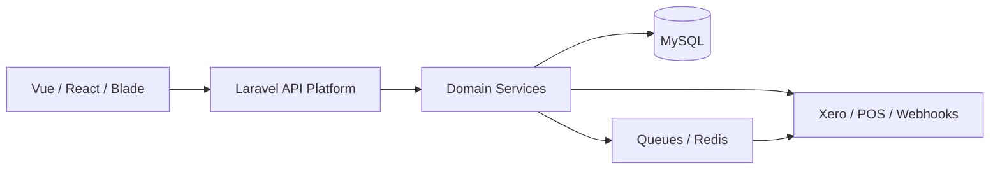

# Hi, I'm Ans Khan 👋

### Backend-first Full-Stack Developer | Laravel / PHP | APIs, Integrations & Reliable Systems

  
  
  
  

  
  

I build backend-led products that keep business workflows consistent under real-world traffic. My strongest area is Laravel and PHP backend engineering, with practical frontend delivery in Vue, React, and TypeScript.

Currently, I work on production retail, hospitality, and loyalty platforms: multi-tenant APIs, POS/till integrations, accounting integrations, background jobs, and the synchronization boundaries where systems need to agree.

I am especially interested in backend and platform roles where correctness, maintainability, and dependable integrations matter as much as feature delivery.

## Architecture lens

I focus on the boundaries where products become dependable: authorization, tenant isolation, state transitions, retries, idempotency, observability, and integration failure handling.

## What I work on

- Designing Laravel APIs, services, middleware, migrations, and Eloquent models
- Multi-tenant architecture and scoped authorization with Sanctum
- POS/till ↔ cloud ↔ loyalty/accounting synchronization
- Xero OAuth 2.0, webhooks, queued jobs, token refresh, and third-party integrations
- Idempotency, pessimistic locking, transactions, and concurrency-safe money-like state
- Vue 3, React, TypeScript, Blade, Tailwind, Vite, and responsive product interfaces
- Tests, diagnostics, production debugging, and API documentation

## Selected work

| Project | What it demonstrates |
| --- | --- |
| [Rent a Car Management SaaS](https://github.com/anskhanz97/rent-a-car-management-system) | Laravel 12 + Vue 3/TypeScript multi-tenant rental operations platform with scoped access, fleet, reservations, pricing, integrations, auditability, and a documented delivery roadmap |
| XEPOS Loyalty Platform | Loyalty programs, members, rewards, tiers, campaigns, QR flows, exports, and POS contracts across retail and hospitality systems |
| Xero Integration Work | OAuth 2.0, invoice/payment/bill workflows, token refresh, queued processing, and protection against out-of-order till webhooks |
| Independent MT5 Expert Advisors | Modular MQL5 systems with detector, order, lifecycle, state, JSON persistence, risk, and diagnostic layers |

Some professional work is kept private because it belongs to the product/company that commissioned it. Where the source cannot be shared, I describe the engineering problem and outcome without exposing proprietary code or data.

## Professional experience

At XEPOS Ltd., I contribute to private retail, hospitality, and loyalty products used across connected till and cloud workflows. My work includes Laravel APIs, multi-tenant loyalty services, Xero integrations, queued jobs, webhooks, synchronization, concurrency-safe ledgers, and frontend delivery in Vue and React.

The source repositories remain private under the company organization. This profile describes my engineering contribution without presenting employer-owned code as personal intellectual property.

### Professional impact across XEPOS products

- **Loyalty:** built and maintained member, reward, tier, campaign, QR, export, and POS-facing workflows
- **Hospitality:** supported product flows and integrations across operational systems where accuracy and reliability matter
- **Retail:** worked on till/cloud synchronization, accounting integrations, webhook processing, and multi-tenant business rules
- **Platform engineering:** handled authentication, queued jobs, token refresh, diagnostics, API contracts, concurrency, and production troubleshooting

Much of this work appears in GitHub's private contribution activity and merged pull-request history, while repository contents remain restricted. The public profile therefore documents the systems, responsibilities, and engineering problems I worked on rather than publishing company source.

## Tech stack

`PHP` `Laravel` `MySQL` `Eloquent` `Laravel Sanctum` `Queues` `Redis` `Vue 3` `React` `TypeScript` `JavaScript` `Tailwind` `Vite` `REST APIs` `OAuth 2.0` `Webhooks` `Git` `Postman` `MQL5`

  

## How I use AI

I use AI tools as part of my development workflow for exploration, scaffolding, documentation, test ideas, and faster iteration. I remain responsible for the design decisions, implementation, security review, tests, debugging, and production behavior of the code I ship.

## Engineering principles

- Make state transitions explicit and observable
- Protect financial and loyalty balances with transactions, locking, and idempotency
- Keep integration boundaries testable and failure-aware
- Prefer clear documentation and small, reviewable changes
- Treat security, privacy, and ownership as part of engineering quality

## Connect

- Email: [anskhanz97@gmail.com](mailto:anskhanz97@gmail.com)
- LinkedIn: [linkedin.com/in/anskhano](https://linkedin.com/in/anskhano)
- Location: Lahore, Pakistan

## A little more

I enjoy the difficult edges of software: the race condition that only appears under concurrent till traffic, the webhook that arrives out of order, and the integration boundary where two systems disagree. Those are usually where reliable engineering makes the biggest difference.
