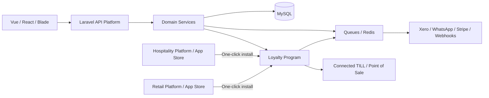

# Hi, I'm Ans Khan 👋

### Backend-first Full-Stack Developer | Laravel / PHP | APIs, Integrations & Reliable Systems

<a href="https://anskhanz97.github.io"><strong>🌐 View my interactive portfolio: anskhanz97.github.io</strong></a>

  
  
  
  

  
  

I build backend-led products that keep business workflows consistent under real-world traffic. My strongest area is Laravel and PHP backend engineering, with practical frontend delivery in Vue, React, and TypeScript.

Currently, I work on production retail, hospitality, and loyalty platforms: multi-tenant APIs, TILL and Point of Sale integrations, accounting integrations, background jobs, and the synchronization boundaries where systems need to agree.

I am especially interested in backend and platform roles where correctness, maintainability, and dependable integrations matter as much as feature delivery.

## Architecture lens

I focus on the boundaries where products become dependable: authorization, tenant isolation, state transitions, retries, idempotency, observability, and integration failure handling. The Loyalty Program is a good example: Hospitality and Retail act as the host platforms—the Middle Applications whose app stores can install the Loyalty application—while the Loyalty service connects to their TILL and Point of Sale workflows and keeps member, reward, redemption, and balance state synchronized.

### How I think about the architecture

- **API-first contracts:** design REST endpoints, validation rules, authentication, pagination, error responses, and stable contracts for multiple client applications
- **Asynchronous work:** use queues and Redis for exports, notifications, synchronization, retries, webhook processing, and long-running integration jobs
- **Reliable synchronization:** reconcile TILL, Point of Sale, cloud, Loyalty, and accounting state while handling duplicates, retries, out-of-order events, and partial failures
- **Safe domain state:** use transactions, pessimistic locking, idempotency keys, explicit state machines, and audit trails for balances, payments, rewards, and operational records
- **Integration boundaries:** isolate OAuth 2.0, token refresh, webhooks, third-party APIs, and provider-specific behavior behind testable services
- **Operational feedback:** add diagnostics, structured logs, API documentation, focused tests, and recovery paths so engineers can understand and repair production behavior

The result is architecture that can serve browser clients, background workers, desktop applications, and external platforms without letting each consumer invent its own business rules. A major example is the separate Loyalty Program I independently designed and built: it can be installed into the Hospitality or Retail host platform, then connect its workflows to the relevant TILL and Point of Sale environment while keeping data synchronized across the integration boundary.

## What I work on

- Designing Laravel APIs, services, middleware, migrations, and Eloquent models
- Multi-tenant architecture and scoped authorization with Sanctum
- TILL ↔ Point of Sale ↔ cloud ↔ Loyalty/Accounting synchronization
- Xero OAuth 2.0, webhooks, queued jobs, token refresh, and third-party integrations
- Idempotency, pessimistic locking, transactions, and concurrency-safe money-like state
- Vue 3, React, TypeScript, Blade, Tailwind, Vite, and responsive product interfaces
- Tests, diagnostics, production debugging, and API documentation

## Selected work

| Project | What it demonstrates |
| --- | --- |
| [Rent a Car Management SaaS](https://github.com/anskhanz97/rent-a-car-management-system) | Personal Laravel 12 + Vue 3/TypeScript SaaS for rental businesses: multi-tenancy, scoped access, fleet and customer operations, availability, quotations, reservations, pricing, handover/return evidence, maintenance, payments, deposits, owner settlements, integrations, auditability, OpenAPI, queues, Horizon, and a documented delivery roadmap |
| Loyalty Program | Independently designed and built as a separate, reusable platform installed into Hospitality and Retail host applications; connects their TILL and Point of Sale workflows and covers members, rewards, tiers, campaigns, QR flows, exports, redemptions, balances, and integration contracts |
| Xero Integration Work | OAuth 2.0, invoice/payment/bill workflows, token refresh, queued processing, synchronization commands, and protection against duplicate or out-of-order TILL webhooks |
| Independent MT5 Trading Bots & Strategy Systems | Freelance engineering for a limited private group of Forex/Gold traders: automated, event-driven trading systems with signal detection, order execution, lifecycle state, persistence, risk controls, diagnostics, and extensive testing |

### Additional portfolio projects

| Project | Focus |
| --- | --- |
| [Tasmiya Enterprises](https://github.com/anskhanz97/tasmiya-enterprises) | Freelance Laravel/Blade business website and profile-management system for an active Lahore-based business, with authentication, role-based administration, team profiles, multi-division content, responsive layouts, and project-owned assets |
| [GoldEA](https://github.com/anskhanz97/GoldEA) | H1 Gold/XAUUSD engulfing strategy with deterministic setup IDs, multi-order range execution, visual setup state, trade lifecycle handling, narrative/table diagnostics, and planned JSON-backed persistence |
| [GoldEA-Magic](https://github.com/anskhanz97/GoldEA-Magic) | Modular engulfing strategy focused on magic-number identity, timestamp tracking, persistent state, duplicate prevention, and lifecycle reconstruction |
| [GoldEA-TicketIds](https://github.com/anskhanz97/GoldEA-TicketIds) | Ticket-history detection, setup identity, deterministic duplicate prevention, and reliable reconstruction of what happened to each trade setup |
| [GoldEA-15mPinbarBollingerband](https://github.com/anskhanz97/GoldEA-15mPinbarBollingerband) | 15-minute Pin Bar and Bollinger Band system with candle-quality, structure, volume, ATR, risk-cap, partial take-profit, breakeven, and trailing-stop experiments |
| [FvgEA](https://github.com/anskhanz97/FvgEA) | Fair Value Gap detection with separated signal analysis, order execution, chart-object lifecycle, and modular MQL5 design |

### Why the MT5 work matters

MQL4 and MQL5 are C/C++-influenced languages used to build programs for MetaTrader, including Expert Advisors that react to market events, inspect price data, place and manage broker orders, and maintain state over time. I approach them like small event-driven backend systems: strategy modules detect signals, execution modules call the trading platform, lifecycle modules reconcile order and position state, persistence prevents duplicate actions, and diagnostics make every decision explainable. That requires the same engineering habits used in backend work—clear boundaries, deterministic identifiers, state machines, failure handling, risk controls, observability, and repeated testing—applied to a very different domain.

These EAs were developed as personal/freelance systems for a limited private group of Forex and Gold traders. Each has a different purpose and execution model, from engulfing setups and ticket-history reconstruction to Pin Bar/Bollinger Band signals and Fair Value Gap detection. They are research and engineering projects, not public investment products or promises of financial performance.

### Additional application projects

| Project | What it demonstrates |
| --- | --- |
| Human Resource Management System | End-to-end Laravel, Vue.js, and MySQL platform with employee management, attendance, leave, expenses, performance evaluation, authentication, responsive workflows, and data integrity |
| Online Laundry Management System | Laravel/MySQL operations platform for order placement, tracking, payments, staff scheduling, real-time notifications, and reporting/analytics |
| All About Dairy B2B Marketplace | Laravel/MySQL marketplace connecting farmers, distributors, and retailers with real-time pricing, vendor management, supply-chain visibility, and escrow payment workflows |
| Car Parking Management System | Laravel/MySQL parking platform with real-time slot availability, digital ticket generation, authentication, payments, and occupancy analytics |

Some professional work is kept private because it belongs to the product/company that commissioned it. Where the source cannot be shared, I describe the engineering problem and outcome without exposing proprietary code or data.

## Professional experience

My experience spans production product companies, client-facing application teams, infrastructure support, and independent/freelance product delivery. I have worked across retail, Hospitality, Loyalty, business operations, marketplaces, HR, logistics, and automation systems—not only within one repository or one company.

### Systems Limited — Cloud & Infrastructure Technical Support Intern

Configured Microsoft AX 2012 and Microsoft Dynamics 365 environments, gained practical exposure to Microsoft Azure and Power Platform, and supported customers by investigating Microsoft product issues and managing technical queries through Email and Microsoft Teams.

### iT Life — Backend Developer, PHP/Laravel

Built and maintained custom PHP/Laravel and JavaScript applications, supported responsive cross-device experiences, collaborated with cross-functional teams on releases, and provided ongoing maintenance, updates, and technical support for live client websites.

### STechSole — Laravel Developer

Built and maintained REST APIs in Laravel for Vue.js, HTML, CSS, and JavaScript clients; delivered responsive Blade and Vue.js interfaces across multiple client applications; worked with Product and Design; and improved existing systems through modular service-layer code, middleware, migrations, debugging, optimization, and regression reduction.

### XEPOS Ltd. — Full Stack Developer

I contribute to private Retail, Hospitality, and Loyalty products used across connected TILL, Point of Sale, desktop, and cloud workflows. My work includes Laravel APIs, multi-tenant Loyalty services, Xero integrations, queued jobs, Webhooks, synchronization, concurrency-safe ledgers, and frontend delivery in Vue and React.

The source repositories remain private under the company organization. This profile describes my engineering contribution without presenting employer-owned code as personal intellectual property.

### Professional impact across different projects

- **Loyalty platform architecture:** independently designed and built a complete, separate Loyalty Program that can be installed into Hospitality and Retail host applications, then integrated with their TILL and Point of Sale workflows while synchronizing state across the integration boundary
- **Loyalty Program:** built and maintained member, reward, tier, campaign, QR, export, redemption, balance, and Point of Sale-facing workflows across multiple services
- **Hospitality systems:** supported operational product flows, integrations, synchronization jobs, and APIs used alongside desktop applications maintained by C# teams
- **Retail platforms:** worked on TILL/cloud synchronization, accounting integrations, Webhook processing, multi-tenant business rules, and resilient event flows
- **Laravel backend:** delivered APIs, controllers, form requests, middleware, policies, services, jobs, events, listeners, notifications, migrations, Eloquent models, resources, and scheduled commands
- **Queues and workers:** handled queued exports, webhook processing, integration retries, token refresh, background synchronization, failure recovery, and operational diagnostics using queue and Redis patterns
- **Queue reliability on Forge:** created and configured multiple queue workers on Laravel Forge to distribute workloads, prevent bottlenecks, improve throughput, and provide capacity for future growth
- **After-commit consistency:** used Laravel `DB::afterCommit` patterns when workers were saturated or overloaded, ensuring follow-up jobs were dispatched only after the database transaction had safely committed
- **Data correctness:** protected loyalty and money-like state with transactions, locking, idempotency, validation, auditability, and explicit state transitions
- **API enablement:** provided and maintained APIs for C# desktop developers, helping them build, integrate, debug, and maintain desktop workflows without duplicating core business rules
- **Third-party APIs:** integrated and maintained Xero, WhatsApp, Stripe, Point of Sale, and other external APIs with authentication, Webhooks, retries, token refresh, and failure-aware processing
- **Application automation:** built synchronization commands, schedulers, observers, events, listeners, and background workflows to keep platforms aligned without relying on manual intervention
- **Cross-architecture delivery:** translated business requirements into coordinated changes across Laravel services, databases, queue workers, Third-party APIs, browser clients, and C# desktop applications while collaborating with multiple specialist teams and projects
- **Production ownership:** investigated defects across client, API, queue, database, and third-party boundaries, then improved tests, diagnostics, documentation, and recovery paths

Much of the XEPOS work appears in GitHub's private contribution activity and merged pull-request history, while repository contents remain restricted. The public profile therefore documents the systems, responsibilities, and engineering problems I worked on rather than publishing company source.

## Tech stack

`PHP` `Laravel` `MySQL` `Eloquent` `Laravel Sanctum` `Queues` `Redis` `Vue 3` `React` `TypeScript` `JavaScript` `Tailwind` `Vite` `REST APIs` `OAuth 2.0` `Webhooks` `Git` `Postman` `MQL5`

  

## How I use AI

I use AI tools as part of my development workflow for exploration, scaffolding, documentation, test ideas, and faster iteration. I remain responsible for the design decisions, implementation, security review, tests, debugging, and production behavior of the code I ship.

## Engineering principles

- **Make state transitions explicit:** model important changes—such as a reservation, reward redemption, payment, or trade setup—as named, validated states instead of relying on loosely related flags.
- **Protect critical data:** use transactions, locking, idempotency, and audit history when concurrent requests could affect balances, availability, payments, or Loyalty records.
- **Design for failure:** assume queues, Webhooks, Third-party APIs, networks, and external providers can retry, arrive out of order, or become unavailable; make recovery safe and observable.
- **Keep boundaries understandable:** give each module, API, worker, and integration a clear responsibility so teams can change one part without silently breaking another.
- **Prefer evidence over assumption:** use tests, structured logs, diagnostics, documentation, and reproducible workflows to explain what the system did and why.
- **Treat security and ownership as engineering quality:** protect credentials and customer data, apply least privilege, and clearly distinguish personal work from client- or company-owned systems.

## Connect

- Portfolio: [anskhanz97.github.io](https://anskhanz97.github.io)
- Email: [anskhanz97@gmail.com](mailto:anskhanz97@gmail.com)
- LinkedIn: [linkedin.com/in/anskhano](https://linkedin.com/in/anskhano)
- Location: Lahore, Pakistan

## A little more

I enjoy the difficult edges of software: the race condition that only appears under concurrent till traffic, the webhook that arrives out of order, and the integration boundary where two systems disagree. Those are usually where reliable engineering makes the biggest difference.
